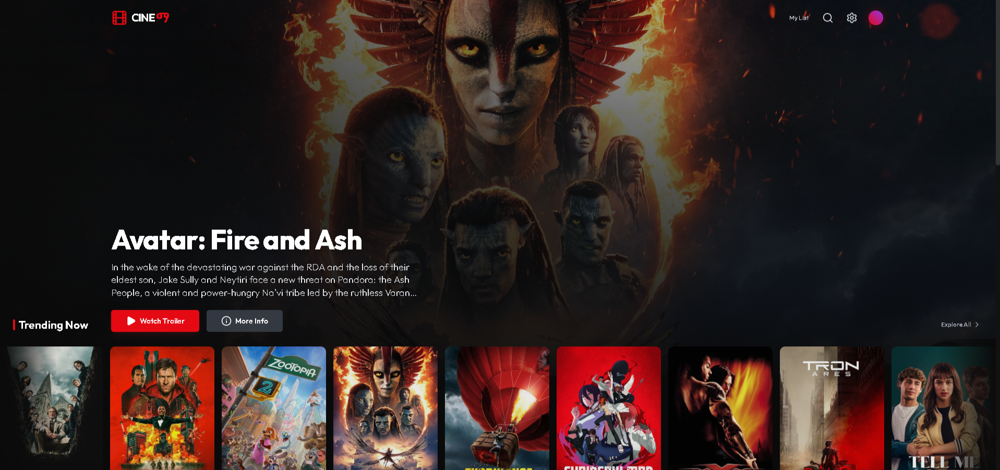

# Cineማ (CineMa)

<!-- Project Screenshots -->
<p align="center">
  
</p>

<p align="center">
  
  
</p>

**Cineማ** is a visually stunning, immersive movie discovery platform built with modern web technologies. Blending English and Amharic identity ("Ma" / "ማ"), this application offers a cinematic user experience, allowing users to browse trending content, watch trailers, and manage a personal watchlist.

## 🚀 Live Demo
[Insert Link to Live Demo Here]

---

## 📖 Table of Contents
- [Features](#-features)
- [Tech Stack](#-tech-stack)
- [File Structure](#-file-structure)
- [Installation & Setup](#-installation--setup)
- [API Configuration](#-api-configuration)
- [Methods & Techniques](#-methods--techniques)
- [Future Enhancements](#-future-enhancements)
- [Developer](#-developer)

---

## ✨ Features

### Core Functionality
- **Dynamic Content**: Fetches real-time data for Trending, Popular, Top Rated, and Upcoming movies.
- **Hero Parallax**: Immersive hero section with background parallax effects and smooth transitions.
- **Real-time Search**: Instant movie search functionality by title or keyword.
- **Watchlist Persistence**: Users can add movies to "My List", which persists via Local Storage.
- **Movie Details**: Comprehensive modal view containing:
  - Cast & Crew information.
  - Synopses and Taglines.
  - HD Trailers (YouTube Integration).
  - "More Like This" recommendations.
- **Video Player**: Integrated, secure YouTube player with autoplay and clean UI parameters.

### UI/UX
- **Responsive Design**: Fully optimized for Mobile, Tablet, and Desktop.
- **Cinematic Aesthetics**: Dark mode interface with glassmorphism, glows, and smooth animations.
- **Visual Feedback**: Hover effects, loading skeletons, and interactive transitions.
- **Bilingual Identity**: Unique branding integrating Amharic script.

---

## 🛠 Tech Stack

### Frontend Framework
- **React 19**: Utilizing modern functional components and Hooks.
- **TypeScript**: Strictly typed interfaces for robust data handling.

### Styling & UI
- **Tailwind CSS**: Utility-first CSS framework for rapid, responsive styling.
- **Lucide React**: Modern, lightweight icon library.
- **Fonts**: `Outfit` (sans-serif) and `Noto Sans Ethiopic` (Amharic support).

### Data & API
- **The Movie Database (TMDB) API**: Source for all movie data, images, and metadata.
- **Fetch API**: Native browser API for asynchronous network requests.

---

## 📂 File Structure

```text
Cineማ/
├── components/           # Reusable UI Components
│   ├── Hero.tsx          # Featured movie banner with parallax
│   ├── Icons.tsx         # Centralized icon exports
│   ├── MovieCard.tsx     # Individual movie display card
│   ├── MovieModal.tsx    # Detailed view & video player
│   └── Navbar.tsx        # Navigation, search, and settings
├── services/
│   └── tmdb.ts           # API service layer (endpoints, key management)
├── App.tsx               # Main application logic and routing
├── index.html            # Entry point & Import Maps
├── index.tsx             # React DOM root mounting
├── metadata.json         # Project metadata
├── types.ts              # TypeScript interfaces (Movie, Cast, API responses)
└── README.md             # Project documentation
```

---

## ⚡ Installation & Setup

This project uses **ES Modules** and **CDN imports** (via `esm.sh`) for a lightweight, zero-build configuration suitable for modern browsers.

### Prerequisites
- A modern web browser (Chrome, Edge, Firefox, Safari).
- A local server (VS Code Live Server, Python SimpleHTTPServer, or Node `http-server`).

### Steps
1. **Clone the Repository**
   ```bash
   git clone https://github.com/your-username/cinema-app.git
   cd cinema-app
   ```

2. **Run the Project**
   Because this project uses ES modules, you cannot open `index.html` directly via the `file://` protocol due to CORS policies. You must use a local server.

   *Using Python:*
   ```bash
   python3 -m http.server 8000
   ```
   *Using Node:*
   ```bash
   npx http-server .
   ```

3. **Open in Browser**
   Navigate to `http://localhost:8000`.

---

## 🔑 API Configuration

This application requires a **TMDB API Key** to function.

1. Register for an account at [The Movie Database](https://www.themoviedb.org/).
2. Navigate to Settings > API to generate your free API Key (v3).
3. Open the **Cineማ** app in your browser.
4. You will be prompted with a secure modal to enter your key.
5. The key is stored locally in your browser (`localStorage`) and is never sent to any server other than TMDB.

---

## 🧩 Methods & Techniques

- **State Management**: React `useState` and `useEffect` hooks control data flow, loading states, and view transitions ('home', 'search', 'watchlist').
- **Component Composition**: Modular architecture separating layout (Navbar), presentation (MovieCard), and logic (App.tsx).
- **Asynchronous Data Handling**:
  - `Promise.all` used to fetch multiple categories (Trending, Popular, etc.) in parallel for faster initial load.
  - `async/await` syntax for clean asynchronous code in `services/tmdb.ts`.
- **Security**:
  - YouTube Iframe utilizes `origin` and `rel=0` parameters to prevent Cross-Origin errors and ensure strict privacy policies.
  - API Key injection via UI avoids hardcoding secrets in the codebase.

---

## 🚀 Future Enhancements

- [ ] **User Authentication**: Firebase or Supabase integration for multi-device watchlist syncing.
- [ ] **Genre Filtering**: Advanced filtering sidebar for specific genres.
- [ ] **Pagination**: Infinite scroll implementation for movie rows.
- [ ] **TV Shows**: Tab to switch between Movies and TV Series.
- [ ] **PWA Support**: Progressive Web App capabilities for installability on mobile devices.

---

## 👨‍💻 Developer

**Developed by Ethel Technologies**

*   **Lead Developer**: Natnael Sintayehu
*   **Role**: Senior Frontend Engineer & UI/UX Designer

### 🔗 Connect
-[](https://linkedin.com/in/natnael-sintayehu-84b669254)
[](https://github.com/ethel-7)
[](https://t.me/natnael_sintayehu)
[](https://www.instagram.com/ethel.tech)

---

*© 2025 Ethel Technologies. All Rights Reserved.*
